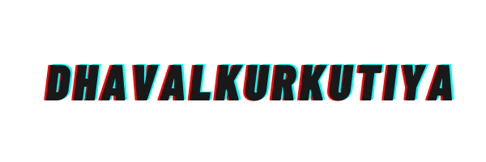

  
# Hi, I'm DhavalKurkutiya! 👋

### Web Development
Web development is the building and maintenance of websites; it’s the work that happens behind the scenes to make a website look great, work fast and perform well with a seamless user experience.

Web developers, or ‘devs’, do this by using a variety of coding languages. The languages they use depends on the types of tasks they are preforming and the platforms on which they are working.

Web development skills are in high demand worldwide and well paid too – making development a great career option. It is one of the easiest accessible higher paid fields as you do not need a traditional university degree to become qualified.

The field of web development is generally broken down into front-end (the user-facing side) and back-end (the server side). Let’s delve into the details.

## 🔗 Links

## 🚀 About Me
I'm a full Computer Engineering Student...

## 🎉 Support
For support, email kurkutiyadhaval30@gmail.com or join our Slack channel.
